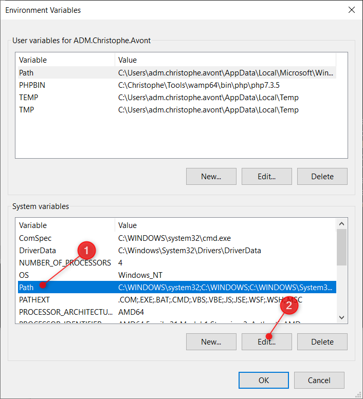
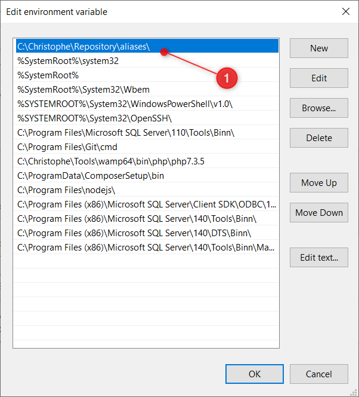

<!-- This file has been generated by the concat.sh script. -->
<!-- Don't modify this file manually (you'll loose your changes) -->
<!-- but run the tool once more -->
<!-- Last refresh date: Thursday, April 27, 2023, 13:48:18 -->

# Bash tips


## Free dev guide

`Introduction to bash scripting` is a free Introduction to Bash Scripting eBook: 
[https://github.com/bobbyiliev/introduction-to-bash-scripting](https://github.com/bobbyiliev/introduction-to-bash-scripting)

<!-- table-of-contents - start -->
* [Free dev guide](#free-dev-guide)
* [Tips](#tips)
  * [Linting](#linting)
  * [Debugging](#debugging)
  * [Coding tips](#coding-tips)
    * [Options](#options)
* [let script exit if an unsed variable is used](#let-script-exit-if-an-unsed-variable-is-used)
* [let script exit if a command fails](#let-script-exit-if-a-command-fails)
    * [Redirect to stderr](#redirect-to-stderr)
    * [Use default values](#use-default-values)
    * [Retrieve the folder of the running script](#retrieve-the-folder-of-the-running-script)
    * [Retrieve the folder of the current script](#retrieve-the-folder-of-the-current-script)
    * [Use the function keyword](#use-the-function-keyword)
    * Prefer [[ ... ]] and ==
    * [Add a namespace to your helpers](#add-a-namespace-to-your-helpers)
    * [Read command line arguments and set them to readonly then](#read-command-line-arguments-and-set-them-to-readonly-then)
    * [Add a main function](#add-a-main-function)
* [Helpers](#helpers)
  * [The console helper](#the-console-helper)
    * [How to use this script?](#how-to-use-this-script)
    * [Dependency](#dependency)
    * [Extra information](#extra-information)
      * [Long string](#long-string)
  * [Load an external environment file](#load-an-external-environment-file)
  * [The log helper](#the-log-helper)
    * [How to use this script?](#how-to-use-this-script)
    * [Command line arguments](#command-line-arguments)
    * [Dependency](#dependency)
* [Working with JSON content](#working-with-json-content)
  * [Using jq, make sure it's installed](#using-jq-make-sure-it-s-installed)
  * [JSON lint](#json-lint)
  * [Get the list of keys](#get-the-list-of-keys)
  * [Get the list and keys](#get-the-list-and-keys)
* [Working with XML content](#working-with-xml-content)
  * [Using xmlstarlet, make sure it's installed](#using-xmlstarlet-make-sure-it-s-installed)
  * [XML lint](#xml-lint)
  * [XPath](#xpath)
    * [Get the list of titles](#get-the-list-of-titles)
    * [Get the list of titles when the category is children](#get-the-list-of-titles-when-the-category-is-children)
  * [Free dev guide](#free-dev-guide)
  * [Bash with git bash](#bash-with-git-bash)
  * [Run bash from Windows 10](#run-bash-from-windows-10)
    * [Add an alias](#add-an-alias)
    * [Possible problems](#possible-problems)<!-- table-of-contents - end -->

## Tips

### Linting

Run `/bin/bash -n script.sh` to lint it i.e. verify his syntax with running it. 

### Debugging

Run `/bin/bash -x script.sh` to debug it i.e. to see every commands executed by the shell interpretor

### Coding tips

#### Options

Add these lines at the top of every scripts:

```bash
## let script exit if an unsed variable is used
set -o nounset

## let script exit if a command fails
set -o errexit
```

This will improve the quality of your script by forcing the developer to declare each variable before its first use and to ask the shell intrepretor to leave the script as soon as a command fails.

#### Redirect to stderr

When you'll write an error make sure to always write to STDERR (i.e. `&2`), for instance:

```bash
echo "[$(date +'%Y-%m-%dT%H:%M:%S%z')]: ERROR - $*" >&2
```

This will allow to be able to separate normal output (STDOUT) and errors (STRERR).

Extra tip: use `${FUNCNAME[0]}` to get the name of the running function

```bash
echo "[$(date +'%Y-%m-%dT%H:%M:%S%z')]: ERROR in function ${FUNCNAME[0]} - $*" >&2
```

#### Use default values

Use the following syntax `${VERBOSE:-false}` to set a default value when the variable isn't set yet.

#### Retrieve the folder of the running script

The running script is the one executed by the shell interpretor: use `$0`

```bash
SCRIPT_DIR=$(cd -- "$( dirname -- "$0" )" &> /dev/null && pwd)
```

#### Retrieve the folder of the current script

The current script is the one making f.i. an include statement. For instance, the `./script.sh` includes `./bash/log.sh`. And `./bash/log.sh` wish to include the `console.sh` that is in the same folder i.e. `./bash/`. For this use, here is the snippet: use `${BASH_SOURCE[0]}`

```bash
SCRIPT_DIR="$(cd "$(dirname "${BASH_SOURCE[0]}")" >/dev/null 2>&1 && pwd)"
```

#### Use the function keyword

Declare your function with `function` like

```bash
function main() {
    // ...
}
```

#### Prefer [[ ... ]] and ==

For clarity, use `==` for equality rather than `=` even though both work. The former encourages the use of `[[` and the latter can be confused with an assignment

#### Add a namespace to your helpers

Prefer to use something like `console::printYellow()` and not just `printYellow()`. This allow the developer to know where the function is (logically in a file called `console.sh`) and this will reduce the risk of conflict (if you already have such function declared in your scripts).

#### Read command line arguments and set them to readonly then

Once the variable has been initialized, prohibit to change his value using the `readonly` keyword.

```bash
VERBOSE='false'

while getopts 'v' flag; do
    case "${flag}" in
        v) VERBOSE='true' ;;
    esac
done

readonly VERBOSE
```

#### Add a main function

In order to easily find the start of the program, put the main program in a function called main as the bottom most function. This provides consistency with the rest of the code base as well as allowing you to define more variables as local (which can’t be done if the main code is not a function). The last non-comment line in the file should be a call to main:

```bash
main "$@"
```

## Helpers

You'll find here some helpers to work with Bash scripts.

### The console helper

> You can download the console helpers [here](console.sh)

#### How to use this script?

Just include this script in your own Bash like this `. console.sh`

Now, you can use any public functions defined here like `console::printItalic`, `console::printYellow`, `console::printRed` or many others.

#### Dependency

None

#### Extra information

Using a format like below to write text in light green:

```bash
printf "\e[1;92m%s\e[m\n" "Success!"
```

Change the value of `31` (red) to a value between `30` and `37` (for dark) or between `90` and `96` (for light) to use another color (see [https://misc.flogisoft.com/bash/tip_colors_and_formatting#foreground_text](https://misc.flogisoft.com/bash/tip_colors_and_formatting#foreground_text) for more ANSI colors).

##### Long string

The following example shows how to use an array to split a long string into smaller one and print it with one call:

```bash
text=(
    "Line 1 ..."
    "Line 2 ..."
    "Line 3 ..."
)

printf "%s\n" "${text[@]}"
```

Now, you can also use colors. The following line will display each line in red:

```bash
printf "\e[1;31m%s\e[m\n" "${text[@]}"
```

Real example, the following code will display an error message in red:

```bash
text=(
    "ArgumentCountError - Please call ${FUNCNAME[0]}() with one parameter:"
    "the name of the file to read"
    "For instance: ${FUNCNAME[0]} 'readme.txt'"
)

printf "\e[1;31m%s\e[m\n" "${text[@]}"
```

### Load an external environment file

> [https://gist.github.com/mihow/9c7f559807069a03e302605691f85572?permalink_comment_id=3954807#gistcomment-3954807](https://gist.github.com/mihow/9c7f559807069a03e302605691f85572?permalink_comment_id=3954807#gistcomment-3954807)

Imagine you've a `.env` file like

```env
DOCKER_DATABASE_USE_MIGRATION="N"
DOCKER_ENABLE_SYNCHRONIZATION="Y"
DOCKER_GIT_USEREMAIL="christophe@me.com"
DOCKER_GIT_USERNAME="Me and myself"
```

You can load that file easily in your environment using the following instructions:

```bash
set -o allexport
source .env set
set +o allexport
```

This done, variables will be accessible like any environment variables in your bash script. When the script exit, the added variables are removed (just like in a sub-shell).

Using `source` is the best solution to avoid problems with f.i. spaces like in `"Me and myself"` i.e. using others solution like `export $(... | xargs)` will always gives unpredictable results.

### The log helper

> You can download the log helpers [here](log.sh)

#### How to use this script?

1. Include the script in your own Bash like this `. log.sh` (adjust path if needed).
2. Here and there, where you want a log, just type `log::write "This is a log info"`

#### Command line arguments

* `-v` or `--verbose`: enable the logging, entries will be written to a temporary logfile.
* `--immediate-log`: the log entry will be displayed immediately on the console
* `--show-on-exit`: the logfile content will be displayed when the script will exit

#### Dependency

* [console.sh](./../console/console.sh)

## Working with JSON content

### Using jq, make sure it's installed

```bash
#!/bin/sh

if [ -z $(which jq) ]; then
    ## jq not yet installed, install it
    printf "\n\033[0;36mInstall jq\033[0m\n"
    sudo apt-get update && sudo apt-get -y install jq
fi
```

### JSON lint

```bash
echo '{"AssetId":"14462955","Name":"Cultural Item"}' | jq '.'
```

Output:

```json
{
  "AssetId": "14462955",
  "Name": "Cultural Item"
}
```

### Get the list of keys

```bash
echo '{"AssetId":"14462955","Name":"Cultural Item"}' | jq -r '. | keys[]' | 
while IFS= read -r value; do
    echo "The key is $value"
done
```

Output:

```txt
The key is AssetId
The key is Name
```

### Get the list and keys

```bash
echo '{"AssetId":"14462955","Name":"Cultural Item"}' | jq -r 'to_entries | map(.key + " has value " + (.value | tostring)) | .[]'
```

or

```bash
echo '{"AssetId":"14462955","Name":"Cultural Item"}' | jq -r 'to_entries | map(.key + "|" + (.value | tostring)) | .[]' | \
    while IFS='|' read key value; do
        echo "$key has value $value"
    done
```

Output:

```text
AssetId has value 14462955
Name has value Cultural Item
```

## Working with XML content

### Using xmlstarlet, make sure it's installed

```bash
#!/bin/sh

if [ -z $(which xmlstarlet) ]; then
    ## xmlstarlet not yet installed, install it
    printf "\n\033[0;36mInstall xmlstarlet\033[0m\n"
    sudo apt-get update && sudo apt-get -y install xmlstarlet
fi
```

### XML lint

Input: 

```xml
<?xml version="1.0" encoding="UTF-8"?><bookstore><book category="cooking"><title lang="en">Everyday Italian</title><author>Giada De Laurentiis</author><year>2005</year><price>30.00</price></book><book category="children"><title lang="en">Harry Potter</title><author>J K. Rowling</author><year>2005</year><price>29.99</price></book><book category="web"><title lang="en">XQuery Kick Start</title><author>James McGovern</author><author>Per Bothner</author><author>Kurt Cagle</author><author>James Linn</author><author>Vaidyanathan Nagarajan</author><year>2003</year><price>49.99</price></book><book category="web"><title lang="en">Learning XML</title><author>Erik T. Ray</author><year>2003</year><price>39.95</price></book></bookstore>
```

Script:

```bash
cat "data.xml" | xmlstarlet format --indent-spaces 4
```

Output:

```xml
<?xml version="1.0" encoding="UTF-8"?>
<bookstore>
    <book category="cooking">
        <title lang="en">Everyday Italian</title>
        <author>Giada De Laurentiis</author>
        <year>2005</year>
        <price>30.00</price>
    </book>
    <book category="children">
        <title lang="en">Harry Potter</title>
        <author>J K. Rowling</author>
        <year>2005</year>
        <price>29.99</price>
    </book>
    <book category="web">
        <title lang="en">XQuery Kick Start</title>
        <author>James McGovern</author>
        <author>Per Bothner</author>
        <author>Kurt Cagle</author>
        <author>James Linn</author>
        <author>Vaidyanathan Nagarajan</author>
        <year>2003</year>
        <price>49.99</price>
    </book>
    <book category="web">
        <title lang="en">Learning XML</title>
        <author>Erik T. Ray</author>
        <year>2003</year>
        <price>39.95</price>
    </book>
</bookstore>
```

### XPath

Source:

```xml
<?xml version="1.0" encoding="UTF-8"?>
<bookstore>
    <book category="cooking">
        <title lang="en">Everyday Italian</title>
        <author>Giada De Laurentiis</author>
        <year>2005</year>
        <price>30.00</price>
    </book>
    <book category="children">
        <title lang="en">Harry Potter</title>
        <author>J K. Rowling</author>
        <year>2005</year>
        <price>29.99</price>
    </book>
    <book category="web">
        <title lang="en">XQuery Kick Start</title>
        <author>James McGovern</author>
        <author>Per Bothner</author>
        <author>Kurt Cagle</author>
        <author>James Linn</author>
        <author>Vaidyanathan Nagarajan</author>
        <year>2003</year>
        <price>49.99</price>
    </book>
    <book category="web">
        <title lang="en">Learning XML</title>
        <author>Erik T. Ray</author>
        <year>2003</year>
        <price>39.95</price>
    </book>
</bookstore>
```

#### Get the list of titles

```bash
cat "data.xml" | xmlstarlet sel -t -v "/bookstore/book/title"
```

Output:

```txt
Everyday Italian
Harry Potter
XQuery Kick Start
Learning XML
```

#### Get the list of titles when the category is children

```bash
cat "data.xml" | xmlstarlet sel -t -v "//book[@category='children']/title"
```

Output:

```txt
Harry Potter
```

### Free dev guide

`Introduction to bash scripting` is a free Introduction to Bash Scripting eBook: 
[https://github.com/bobbyiliev/introduction-to-bash-scripting](https://github.com/bobbyiliev/introduction-to-bash-scripting)

### Bash with git bash

If you want to use git bash, you must follow these steps:

* Download [Git for Windows](https://gitforwindows.org)
* Install it.
* Execute this command in your power shell console as an administrator:

```bash
$files = (Get-ChildItem 'C:\Program Files\Git\usr\bin\*.exe').FullName

$files.ForEach({Set-ProcessMitigation $_ -Disable ForceRelocateImages})
```

* Edit your system variables by running the `Edit system environment variables` program (i.e. click on the `Start` button then start to type `Edit system...`).
* Click on the `Path` in the **system variable** area (see screen capture below).
  
    

* Move the git command folder before system32
* Execute git as an administrator

### Run bash from Windows 10

If you get trouble by running `bash` from a command prompt, specify the full path like this:

```bash
"C:\Program Files\Git\bin\bash.exe" yourscript.sh
```

It should works now.

#### Add an alias

Don't want to specify each time the full path? Just create an alias.

Edit your system variables by running the `Edit system environment variables` program (i.e. click on the `Start` button then start to type `Edit system...`).

Click on the `Path` in the **system variable** area (see screen capture below).


Add a new folder at the very first position. *I've chosen to create such folder: `C:\Christophe\Repository\aliases\` on my side.*



**Note: make sure the alias folder is at the first position to have the priority to any other command having the same name.**

Go now to your aliases folder and add a new file called `bash.cmd` and edit the file. Type the following content:

```bash
@echo off
REM cls  -- Don't clear the screen, need to keep it for batch operations
REM And make sure to return the exit code
"C:\Program Files\Git\bin\bash.exe" %*

set errorcode=%ERRORLEVEL%

IF %errorcode% NEQ 0 (
    echo     ERROR - The bash script has returned an error %errorcode%
    echo     The command line was:
    echo.
    echo     "C:\Program Files\Git\bin\bash.exe" %*
    echo.
)

EXIT /B %errorcode
```

Since you've modified your `PATH` variable, close any command prompt screen and start a new one.

Now, by just typing `bash` it should works.

#### Possible problems

By just running `bash` from the command prompt, you can get this error:

```text
Windows Subsystem for Linux has no installed distributions.
Distributions can be installed by visiting the Microsoft Store:
https://aka.ms/wslstore
```

Note: the default `bash` interpreter is located in the `C:\Windows\System32\` folder
