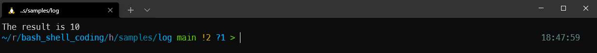
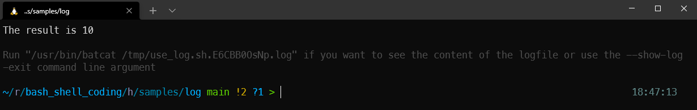
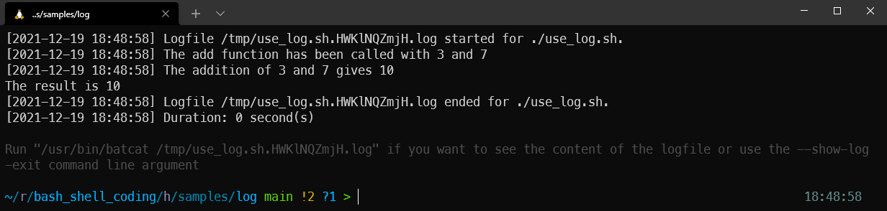
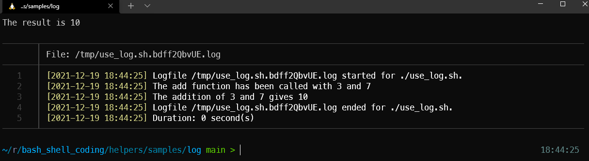
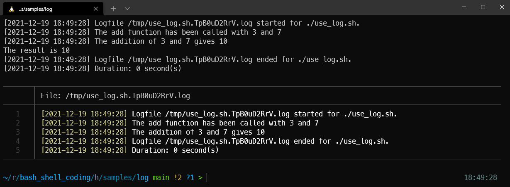

## Objective

The objective of this script is to illustrate how to use the `log.sh` helper. Just include the file in your script and add here and there some `log::write()` calls like you can see in the `add()` function to get advantage of the logging features.

## How to use this script?

Run this script `clear ; ./use_log.sh`. You'll just see *The result is 10* and nothing else.

Also try to run this script like below to see differences:

* `clear ; ./use_log.sh --verbose`
* `clear ; ./use_log.sh --immediate-log`
* `clear ; ./use_log.sh --show-log-exit`

## Screen captures

`clear ; ./use_log.sh`

`clear ; ./use_log.sh --verbose`

`clear ; ./use_log.sh --immediate-log`

`clear ; ./use_log.sh --show-log-exit`

`clear ; ./use_log.sh --immediate-log --show-log-exit`

